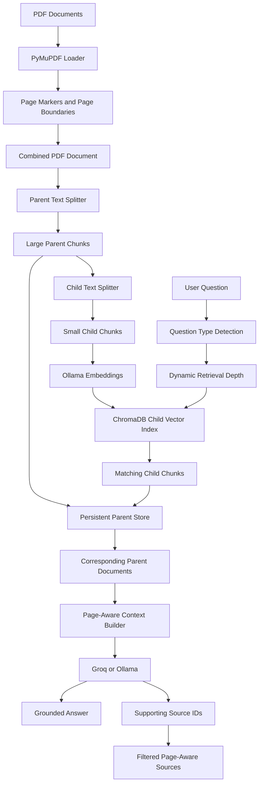

# Enterprise PDF RAG Learning Project

A learning-focused Retrieval-Augmented Generation project for exploring how PDF question-answering systems handle information distributed across pages, chunks, and document sections.

The project started with a traditional RAG pipeline and was gradually extended after identifying practical retrieval problems such as:

* Product information split across multiple pages
* Prices separated from product names
* Incomplete results for “list all” questions
* Relevant products stored in different catalog sections
* Unrelated retrieved documents being displayed as sources
* Small language models omitting information that was present in the context

The goal of this repository is to document my RAG learning process, the problems I encountered, and the solutions I experimented with.

This is a portfolio and learning project. It is not presented as a complete production-ready enterprise RAG platform.

---

## Project Goals

This project was created to learn and demonstrate:

* PDF text extraction
* Document chunking strategies
* Chunk overlap
* Embedding generation
* Vector database indexing
* Semantic search
* Traditional RAG
* Parent-child document retrieval
* Cross-page context handling
* Page-aware source metadata
* Dynamic retrieval depth
* Grounded prompt design
* Groq and Ollama integration
* Source filtering
* RAG limitations and failure analysis

---

## Project Evolution

The project was developed incrementally.

1. Built a traditional PDF RAG pipeline.
2. Added local embeddings using Ollama.
3. Stored chunks in ChromaDB.
4. Tested semantic search and direct question answering.
5. Identified failures when information was split across pages.
6. Added parent-child retrieval.
7. Combined PDF pages while preserving page boundaries.
8. Added persistent parent-document storage.
9. Added page-aware source ranges.
10. Added dynamic retrieval depth for different question types.
11. Integrated Groq for stronger answer generation.
12. Added stricter grounding and filtering instructions.
13. Added answer-linked source filtering.
14. Created an original synthetic PDF for repeatable testing.

---

## Main Problem Explored

A traditional RAG pipeline normally follows this flow:

```text
PDF
  ↓
Fixed-size text chunks
  ↓
Embeddings
  ↓
Vector search
  ↓
Top matching chunks
  ↓
LLM answer
```

This approach works when all required information appears in one retrieved chunk.

However, a document may contain information like this:

```text
Page 1:

RidgeLine Duo 2P
Capacity: 2 people
Weight: 3.4 lbs
```

```text
Page 2:

SKU: NPO-RDG-2P
Price: $349.00 CAD
Waterproof Rating: 3500mm rain fly
```

A traditional chunk-based pipeline may retrieve the product name but fail to retrieve its price or complete specifications.

This project experiments with parent-child retrieval to provide more surrounding context.

---

## Current Features

* PDF loading with PyMuPDF
* Traditional RAG pipeline
* Semantic vector search
* Parent-child document retrieval
* Cross-page context preservation
* Persistent ChromaDB storage
* Persistent local parent-document storage
* Local Ollama embeddings
* Groq answer generation
* Ollama answer-generation option
* Dynamic retrieval depth
* Page-aware source ranges
* Answer-linked source filtering
* Strict grounded-answer prompt
* Numeric filtering
* Category filtering
* Product comparison questions
* “List all” aggregation questions
* Command-line interface
* Synthetic PDF test catalog

---

## Project Architecture



---

## Traditional RAG Pipeline

The traditional pipeline is retained as a baseline.

```text
PDF pages
  ↓
Fixed-size chunks
  ↓
Ollama embeddings
  ↓
ChromaDB
  ↓
Top-K semantic search
  ↓
LLM answer
```

Traditional RAG works well for direct questions when all required information is contained inside the retrieved chunks.

It may become incomplete when:

* A product continues onto another page
* A price appears in a different chunk
* Relevant products exist in multiple sections
* The user asks for all matching products

---

## Parent-Child Retrieval Experiment

The parent-child pipeline uses two chunk sizes.

### Child chunks

Small child chunks are embedded and searched.

```env
CHILD_CHUNK_SIZE=400
CHILD_CHUNK_OVERLAP=80
```

Small chunks help improve semantic search precision.

### Parent chunks

Larger parent chunks are returned after a child chunk matches.

```env
PARENT_CHUNK_SIZE=2000
PARENT_CHUNK_OVERLAP=200
```

The flow is:

```text
Search small child chunks
          ↓
Find matching child
          ↓
Retrieve larger parent document
          ↓
Send richer context to the LLM
```

This helps keep related product details together even when they span nearby pages or chunks.

---

## Page-Aware Context

Each PDF is combined while preserving page markers.

```text
--- PAGE 1 ---

Page-one content

--- PAGE 2 ---

Page-two content
```

The application records the character boundaries of every page.

When a parent chunk is retrieved, the application calculates which PDF pages that chunk overlaps.

Instead of displaying:

```text
start index 3137
```

the application displays:

```text
pages 3-4
```

This produces more readable and useful source information.

---

## Dynamic Retrieval Depth

Different question types require different retrieval breadth.

A direct question does not need the same number of retrieved documents as a catalog-wide aggregation query.

| Question type | Example                                | Default Top-K |
| ------------- | -------------------------------------- | ------------: |
| Narrow lookup | What is the price of RidgeLine Duo 2P? |             3 |
| Detail lookup | What are the features of BaseHaven 6P? |             5 |
| Aggregation   | List all 2-person tents                |            12 |

Configuration:

```env
PARENT_NARROW_TOP_K=3
PARENT_DETAIL_TOP_K=5
PARENT_AGGREGATION_TOP_K=12
```

This reduces irrelevant context for focused questions while keeping broader questions more complete.

The current query classification is keyword-based and remains an area for future improvement.

---

## Answer-Linked Source Filtering

Vector search may retrieve more documents than the answer actually uses.

Each retrieved parent document receives an internal source ID:

```text
S1
S2
S3
```

The answer model returns the source IDs that directly support the final answer.

The application then:

1. Extracts the source IDs.
2. Removes the internal source line from the visible answer.
3. Maps the IDs back to parent documents.
4. Displays only the supporting page ranges.

Example:

```text
Question:
Where can I contact NorthPeak Outfitters?

Retrieved Sources:
- northpeak-synthetic-tent-catalog.pdf, page 8
```

This avoids displaying every retrieved parent as though it directly supported the answer.

---

## Grounding Rules

The answer-generation prompt instructs the model to:

* Use only retrieved context
* Avoid outside knowledge
* Avoid inventing missing values
* Examine every retrieved parent document
* Apply numeric filters exactly
* Apply category filters using explicit document text
* Avoid inferring categories from product names or features
* Include only products satisfying all requested conditions
* Keep each product’s attributes together
* Avoid mixing information from different products
* Return one matching product per table row
* Exclude unrelated products from result tables
* Avoid unsupported page-boundary claims
* Return only source IDs that directly support the answer

These instructions reduce hallucinations, but they do not guarantee perfect output.

---

## Technology Stack

| Category            | Technology                     |
| ------------------- | ------------------------------ |
| Language            | Python                         |
| RAG framework       | LangChain                      |
| PDF loader          | PyMuPDFLoader                  |
| Text splitting      | RecursiveCharacterTextSplitter |
| Embeddings          | Ollama with `nomic-embed-text` |
| Vector database     | ChromaDB                       |
| Parent storage      | LocalFileStore                 |
| Hosted answer model | Groq                           |
| Local answer model  | Ollama                         |
| Configuration       | `python-dotenv`                |
| Interface           | Command-line application       |

---

## Project Structure

```text
enterprise-rag/
│
├── app/
│   ├── cli/
│   │   ├── index_cli.py
│   │   ├── search_cli.py
│   │   ├── rag_cli.py
│   │   └── parent_rag_cli.py
│   │
│   ├── services/
│   │   ├── indexing_service.py
│   │   ├── retrieval_service.py
│   │   ├── rag_service.py
│   │   ├── llm_service.py
│   │   ├── parent_retrieval_service.py
│   │   └── parent_rag_service.py
│   │
│   └── config.py
│
├── documents/
│   └── northpeak-synthetic-tent-catalog.pdf
│
├── main.py
├── requirements.txt
├── .env.example
├── .gitignore
├── LICENSE
└── README.md
```

Generated directories are ignored by Git:

```text
chroma_db/
parent_store/
venv/
```

---

## Synthetic Test Document

This repository uses an original synthetic product catalog created specifically for testing the RAG pipeline.

The catalog contains fictional:

* Company names
* Product names
* SKUs
* Prices
* Specifications
* Addresses
* Email addresses
* Phone numbers
* Warranty terms
* Return policies

The synthetic document does not represent or reproduce a real company or commercial product catalog.

It may be used, modified, and redistributed for educational, portfolio, demonstration, and automated testing purposes.

The test document intentionally contains:

* Product information split across pages
* Prices separated from product introductions
* Multiple products with the same capacity
* Products stored in different categories
* Specialty and four-season products
* Accessories
* Numeric price filters
* Warranty information
* Return information
* Contact details

These scenarios are designed to test retrieval completeness and page-aware source attribution.

---

## Requirements

The main `requirements.txt` contains direct project dependencies.

```txt
langchain
langchain-core
langchain-classic
langchain-community
langchain-text-splitters

langchain-chroma
chromadb

langchain-ollama
ollama

langchain-groq
groq

pymupdf
python-dotenv
```

An exact environment snapshot can optionally be created using:

```powershell
pip freeze > requirements-lock.txt
```

---

## Prerequisites

Install:

* Python 3.11 or later
* Ollama
* Git

A Groq API key is required when Groq is selected for answer generation.

Ollama must still be running when Groq is selected because embeddings are generated locally using Ollama.

---

## Installation

### 1. Clone the repository

```powershell
git clone https://github.com/harsh12sp/enterprise-rag.git
cd enterprise-rag
```

### 2. Create a virtual environment

```powershell
python -m venv venv
```

Activate it in PowerShell:

```powershell
.\venv\Scripts\Activate.ps1
```

### 3. Install dependencies

```powershell
python -m pip install --upgrade pip
pip install -r requirements.txt
```

### 4. Download the embedding model

```powershell
ollama pull nomic-embed-text
```

For local answer generation:

```powershell
ollama pull llama3.2:3b
```

---

## Environment Configuration

Create a `.env` file in the project root.

```env
# Answer-generation provider
LLM_PROVIDER=groq

# Groq configuration
GROQ_API_KEY=your_groq_api_key
GROQ_MODEL=llama-3.3-70b-versatile

# Ollama answer model
OLLAMA_CHAT_MODEL=llama3.2:3b

# Local embeddings
EMBEDDING_MODEL=nomic-embed-text

# LLM settings
LLM_TEMPERATURE=0
LLM_MAX_RETRIES=2

# Documents and storage
DOCUMENTS_DIRECTORY=documents
PERSIST_DIRECTORY=chroma_db
PARENT_STORE_DIRECTORY=parent_store
COLLECTION_NAME=enterprise_documents

# Traditional RAG
CHUNK_SIZE=1200
CHUNK_OVERLAP=200
TOP_K=4

# Parent-child retrieval
PARENT_CHUNK_SIZE=2000
PARENT_CHUNK_OVERLAP=200

CHILD_CHUNK_SIZE=400
CHILD_CHUNK_OVERLAP=80

# Dynamic retrieval
PARENT_NARROW_TOP_K=3
PARENT_DETAIL_TOP_K=5
PARENT_AGGREGATION_TOP_K=12
```

Do not commit the `.env` file.

---

## Git Ignore

Recommended `.gitignore`:

```gitignore
# Secrets
.env

# Virtual environments
venv/
.venv/
env/
test-venv/

# Python cache
__pycache__/
*.py[cod]

# Generated RAG storage
chroma_db/
parent_store/

# Editor files
.vscode/
.idea/

# Operating-system files
.DS_Store
Thumbs.db
```

---

## Running the Application

Start the CLI:

```powershell
python main.py
```

The menu contains:

```text
1. Index Documents
2. Semantic Search
3. Traditional RAG
4. Index and Test Parent Document Retrieval
5. Parent Document RAG
6. Exit
```

---

## Initial Indexing

Run these options once:

```text
1. Index Documents
4. Index and Test Parent Document Retrieval
```

After indexing, use:

```text
5. Parent Document RAG
```

The vector database and parent-document store are persisted locally.

---

## Rebuilding the Index

Rebuild the indexes when:

* A PDF is added
* A PDF is removed
* A PDF is modified
* Chunk sizes change
* The embedding model changes
* Page-boundary metadata changes
* The parent-storage format changes

PowerShell:

```powershell
Remove-Item -Recurse -Force chroma_db -ErrorAction SilentlyContinue
Remove-Item -Recurse -Force parent_store -ErrorAction SilentlyContinue

python main.py
```

Then run both indexing options again.

Changing only the answer-generation model does not require re-indexing.

---

## Example Questions

### Direct lookup

```text
What is the price of RidgeLine Duo 2P?
```

### Cross-page product details

```text
What are the features of BaseHaven 6P?
```

### Aggregation

```text
List all tents that support exactly 2 people, including their prices.
```

### Category filtering

```text
Which 2-person tents are explicitly categorized as specialty or four-season tents?
```

### Numeric filtering

```text
List all tents under $400 that support exactly 2 people.
```

### Comparison

```text
Compare all 2-person tents by price, weight, waterproof rating, and category.
```

### Accessories

```text
List all tent accessories and their prices.
```

### Contact information

```text
Where can I contact NorthPeak Outfitters?
```

---

## Example Output

Question:

```text
List all tents that support exactly 2 people, including their prices.
```

Example answer:

```text
| Product Name | SKU | Price |
|---|---|---:|
| RidgeLine Duo 2P | NPO-RDG-2P | $349.00 CAD |
| CedarTrail Duo 2P | NPO-CDR-2P | $229.00 CAD |
| GlacierGuard Expedition 2P | NPO-GLC-2P | $649.00 CAD |
```

Example sources:

```text
Retrieved Sources:
- northpeak-synthetic-tent-catalog.pdf, pages 1-2
- northpeak-synthetic-tent-catalog.pdf, pages 2-3
- northpeak-synthetic-tent-catalog.pdf, pages 5-6
```

The exact page ranges may vary depending on chunk boundaries and overlap.

---

## Observed Learning Results

During testing, the traditional local pipeline answered direct questions successfully but sometimes omitted matching products from broad aggregation questions.

The parent-child pipeline improved context availability by returning larger parent documents after matching smaller child chunks.

Groq produced more complete aggregation answers than the smaller local Ollama model during the tested scenarios.

Additional prompt rules were required to prevent:

* Category inference from marketing descriptions
* Non-matching products appearing in result tables
* Explanations being inserted as table rows
* Unsupported claims about page boundaries

This project reinforced that RAG accuracy depends on more than selecting an LLM.

Important factors include:

* Document extraction quality
* Chunking strategy
* Retrieval breadth
* Context construction
* Metadata
* Prompt grounding
* Source attribution
* Evaluation

---

## Current Limitations

This project does not work perfectly with every PDF.

### Scanned PDFs

The current pipeline is designed mainly for PDFs with selectable text.

Image-only scanned PDFs may return little or no text.

OCR is not currently implemented.

### Complex Tables

PDF table extraction may lose row and column relationships.

This can separate:

* Product names from prices
* Headers from values
* Specifications from their products

Table-aware parsing is not currently implemented.

### Multi-Column Documents

Text from multi-column PDFs may be extracted in the wrong reading order.

Retrieval cannot correct text that was extracted incorrectly before indexing.

### Images and Diagrams

The current pipeline is text-based.

It does not interpret:

* Product images
* Charts
* Screenshots
* Maps
* Diagrams
* Visual labels

A multimodal pipeline would be required.

### Character-Based Parent Chunks

Parent documents are created using character-based splitting.

A logical product or section can still be divided between parent chunks.

Entity-aware chunking would be more reliable for structured catalogs.

### Overlapping Page Ranges

Parent chunks use overlap to preserve context.

Sources may therefore contain overlapping page ranges:

```text
pages 1-2
pages 2-3
```

This is expected.

### Keyword-Based Query Classification

Dynamic retrieval currently uses keywords to classify questions.

Unusual wording may be assigned the wrong retrieval depth.

A model-based query router could improve this.

### LLM Reliability

Prompt instructions reduce hallucinations but cannot guarantee perfect answers.

The model may still:

* Omit information
* Include unsupported information
* Misapply filters
* Return unexpected formatting
* Select incomplete source IDs

### Source Selection

Answer-linked source filtering relies on source IDs returned by the LLM.

This is useful for demonstration but is not deterministic fact-level citation verification.

### Groq Rate Limits

Groq usage is subject to API rate limits and token quotas.

When the quota is reached, requests may fail with an HTTP 429 error.

The user can switch to Ollama for local answer generation.

### Large Documents

Larger documents and collections may increase:

* Indexing time
* Embedding time
* Retrieval latency
* Context size
* API token usage
* Answer-generation cost

The current setup is intended for local learning and portfolio demonstration.

### No Automated Evaluation Yet

The project has been tested manually.

An automated evaluation suite has not yet been implemented.

---

## Suitable Document Types

The current pipeline is best suited for:

* Text-based product catalogs
* Technical guides
* Policies
* Manuals
* Reports
* Documentation
* Reference PDFs
* Documents with information continuing across nearby pages

Additional preprocessing may be required for:

* Scanned PDFs
* Complex tables
* Multi-column layouts
* Image-heavy documents

---

## Roadmap

### Completed

* [x] Traditional RAG
* [x] Semantic search
* [x] Local Ollama embeddings
* [x] ChromaDB persistence
* [x] Parent-child retrieval
* [x] Persistent parent-document storage
* [x] Cross-page context preservation
* [x] Groq answer generation
* [x] Ollama answer-generation option
* [x] Dynamic retrieval depth
* [x] Page-aware source ranges
* [x] Answer-linked source filtering
* [x] Category and numeric filtering
* [x] Synthetic test PDF
* [x] Manual retrieval testing

### Planned

* [ ] Automated evaluation suite
* [ ] Traditional versus Parent RAG comparison
* [ ] Retrieval precision and recall metrics
* [ ] Entity-aware chunking
* [ ] OCR fallback
* [ ] Table-aware extraction
* [ ] Multi-column layout handling
* [ ] Hybrid dense and keyword retrieval
* [ ] Reranking
* [ ] Structured JSON output validation
* [ ] Automatic Groq-to-Ollama fallback
* [ ] REST API
* [ ] Web interface
* [ ] Docker support
* [ ] Logging and observability
* [ ] Optional Qdrant backend
* [ ] MCP and agentic workflow experiments

---

## Future Evaluation Plan

A future evaluation suite will compare:

| Pipeline            | Retrieval              | Answer model |
| ------------------- | ---------------------- | ------------ |
| Baseline            | Traditional chunks     | Ollama       |
| Parent-child local  | Parent-child retrieval | Ollama       |
| Parent-child hosted | Parent-child retrieval | Groq         |

Planned evaluation metrics:

* Required facts found
* Matching products found
* Incorrect products included
* Source-page accuracy
* Number of retrieved parents
* Number of cited parents
* Response latency
* Retrieval precision
* Retrieval recall

---

## Learning Outcomes

This project helped me develop practical understanding of:

* PDF ingestion
* Chunk-size trade-offs
* Chunk overlap
* Embeddings
* Vector storage
* Semantic retrieval
* Parent-child retrieval
* Page metadata
* Context fragmentation
* Dynamic retrieval
* Prompt grounding
* LLM provider abstraction
* Source attribution
* Hallucination control
* RAG limitations
* Evaluation planning

The focus of the project is not only building a working PDF chatbot, but understanding why RAG systems fail and experimenting with ways to improve them.

---

## Disclaimer

This is a learning and portfolio project.

It is not a production-ready enterprise document platform and should not be used for high-stakes decisions without additional validation, security controls, monitoring, and evaluation.

---

## License

This project is licensed under the MIT License.

See the `LICENSE` file for details.
